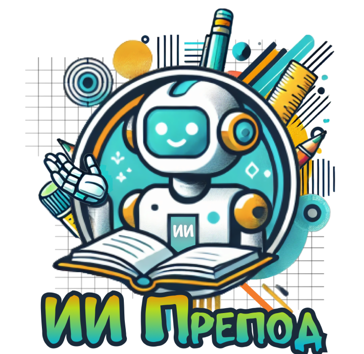
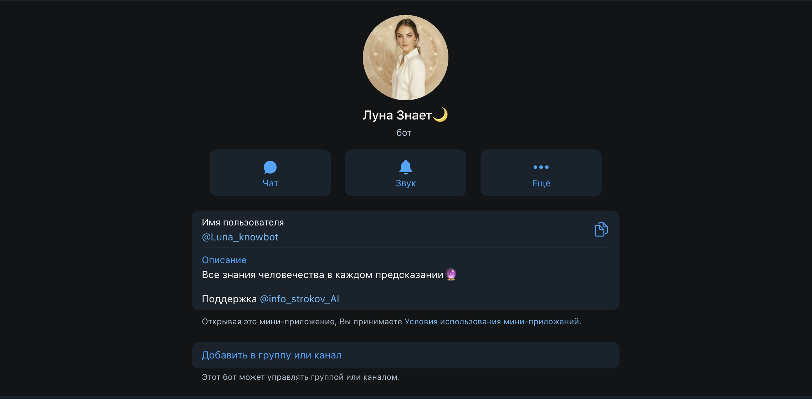

  

  
  
  

---

## Обо мне

Я — **Middle Python Fullstack Developer (backend-first)** с **3+ годами коммерческого опыта**.

Занимаюсь разработкой **AI-powered продуктов**, где важны не только фичи, но и то, как система ведёт себя в продакшене: стабильность, предсказуемость, обработка краевых сценариев, интеграции, скорость разработки и удобство для пользователя.

Обычно веду задачи **от идеи до продакшена**:
- проектирую архитектуру и API
- продумываю валидацию и edge cases
- подключаю AI, realtime, Telegram, платежные системы
- довожу фичу до рабочего production-состояния и поддерживаю дальше

---

## Стек

  

 

| Направление | Технологии |
|---|---|
| **Backend** | Python, FastAPI, Django/DRF, REST API, gRPC, WebSocket, SSE, asyncio |
| **AI / LLM** | OpenAI Assistants API, Realtime API, tool calling, streaming, Whisper, TTS, LangChain |
| **Frontend** | React 18, TypeScript, Vite, SASS, MobX, Recharts, Three.js |
| **Data / Infra** | PostgreSQL, Redis, SQLAlchemy, asyncpg, Docker, Kubernetes, Nginx, CI/CD |

---

## Избранные проекты

<table>
  <tr>
    <td width="50%" valign="top">
      <h3 align="center">EvoSpeak / Yespeak</h3>
      

        
          
        
      

       
      

        <b>Платформа изучения английского с AI-тьютором</b>, где обучение строится не как набор упражнений, а как живая адаптивная система под конкретного пользователя.
      

      
<b>Что внутри:</b>

      <ul>
        <li>чат с AI-преподавателем</li>
        <li>уроки, тесты и экзамены</li>
        <li>голосовой ввод и TTS</li>
        <li>Realtime API и живое взаимодействие</li>
        <li>монетизация через YooKassa</li>
      </ul>
    </td>
    <td width="50%" valign="top">
      <h3 align="center">ИИ Препод</h3>
      

        
          
        
      

       
      

        <b>EdTech-платформа для школьников</b> с AI-тьютором, сессиями обучения, подготовкой к экзаменам и Telegram-интеграцией.
      

      
<b>Что внутри:</b>

      <ul>
        <li>AI-репетитор и учебные сценарии</li>
        <li>чат и сессионная логика</li>
        <li>SMS-авторизация</li>
        <li>токен-биллинг</li>
        <li>нагрузка до ~1000 пользователей одновременно</li>
      </ul>
    </td>
  </tr>
</table>

---

<table>
  <tr>
    <td width="50%" valign="top">
      <h3 align="center">Luna</h3>
      

        
      

       
      

        <b>Telegram-бот с AI-механиками</b> для астрологических разборов, прогнозов и персонализированного контента.
      

      
<b>Что реализовано:</b>

      <ul>
        <li>натальные карты и ежедневные прогнозы</li>
        <li>генерация PDF-отчётов</li>
        <li>подписки и платежи</li>
        <li>timezone-aware планировщик</li>
        <li>автоматическая выдача персонального контента</li>
      </ul>
    </td>
    <td width="50%" valign="top">
      <h3 align="center">Chester Feya CRM + НБКИ</h3>
       
      

        <b>CRM-система и Telegram-бот</b> с AI-менеджером, который умеет работать с данными через естественный язык.
      

      
<b>Что реализовано:</b>

      <ul>
        <li>генерация SQL-запросов по текстовому описанию</li>
        <li>парсинг PDF-отчётов в JSON</li>
        <li>gRPC-интеграции</li>
        <li>React-админка</li>
        <li>аналитика и автоматизация внутренних процессов</li>
      </ul>
    </td>
  </tr>
</table>

---

## На чём я специализируюсь

| Область | Что делаю |
|---|---|
| **Backend-архитектура** | проектирую API и сервисы, которые нормально ведут себя в продакшене |
| **AI-интеграции** | встраиваю LLM, streaming, tool calling, voice и assistants в реальные продуктовые сценарии |
| **Realtime-системы** | WebSocket, SSE, event-driven взаимодействие |
| **Telegram-экосистема** | боты, сценарии, уведомления, пользовательские потоки |
| **Платежи и монетизация** | YooKassa, Telegram Payments, токен-биллинг |
| **Автоматизация** | PDF, планировщики, фоновые процессы, сервисная логика |

---

## Подход к разработке

- предпочитаю понятную архитектуру хаосу
- думаю не только о happy path, но и о краевых сценариях
- люблю, когда продукт не просто работает, а ведёт себя предсказуемо
- ценю аккуратность, читаемость и адекватные инженерные решения
- ориентируюсь на реальную пользу для пользователя, а не на “демо ради демо”

---

## GitHub Stats

  
  

---

## Контакты

  <a href="https://myresume-azora.ru">Сайт-портфолио</a> •
  <a href="https://t.me/azora929">Telegram</a> •
  <a href="mailto:dreminaleksandr06@gmail.com">Email</a>

 

  

