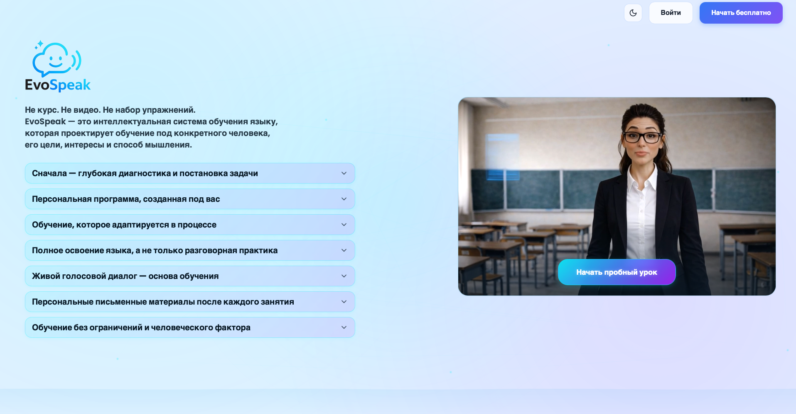
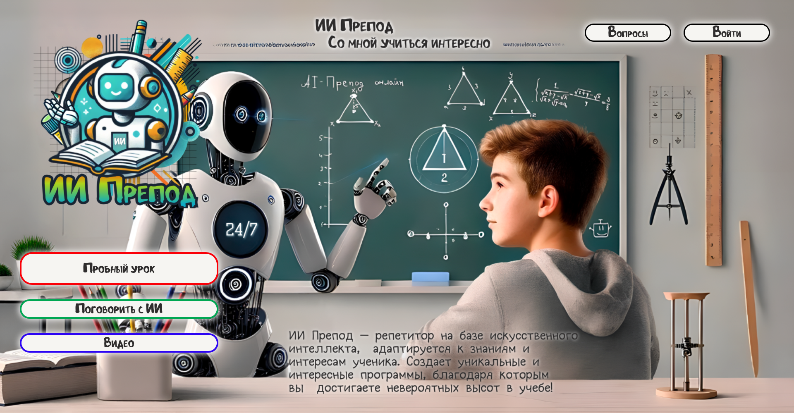
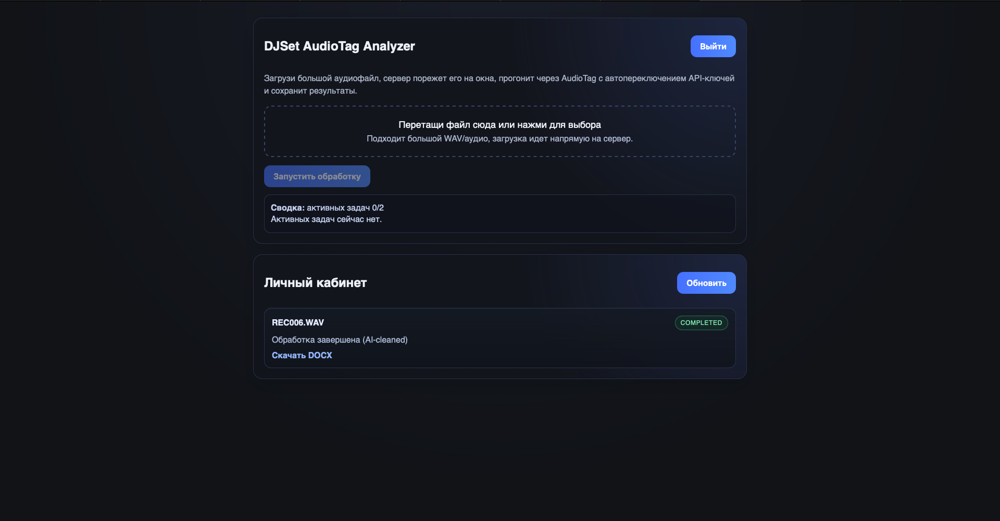

  

  
  
  

---

## Обо мне

Я — **Middle Python Fullstack Developer (backend-first)** с сильным уклоном в **backend, AI-интеграции, realtime-сценарии и production-ready архитектуру**.

Занимаюсь разработкой сервисов, где важно не только быстро сделать фичу, но и довести её до рабочего состояния:  
от проектирования API и бизнес-логики до интеграций, обработки edge cases, фоновых задач, платежей, realtime и поддержки в продакшене.

Обычно веду задачи **от идеи до продакшена**:
- проектирую архитектуру и API
- продумываю валидацию и пользовательские сценарии
- подключаю AI, Telegram, платежи, очереди, realtime
- оптимизирую производительность и стабильность
- довожу решение до production-ready состояния

---

## Стек

  

 

| Направление | Технологии |
|---|---|
| **Backend** | Python, FastAPI, Django, Django REST Framework, REST API, gRPC, WebSocket, asyncio |
| **AI / LLM** | OpenAI API, Assistants API, Realtime API, Responses API, tool calling, streaming, Whisper, TTS, LangGraph |
| **Frontend** | React 18, TypeScript, Vite, SCSS, MobX, Recharts, Three.js |
| **Databases / Queues** | PostgreSQL, Redis, MongoDB, SQLAlchemy, asyncpg, Celery |
| **Infra** | Docker, Kubernetes, Nginx, Linux, SSL/TLS, CI/CD |

---

## Избранные проекты

<table>
  <tr>
    <td width="50%" valign="top">
      <h3 align="center">EvoSpeak / Yespeak</h3>
      

        
          
        
      

       
      

        <b>AI-платформа для изучения английского</b> с чат-уроками, тестами, экзаменами, голосовыми сценариями и монетизацией.
      

      
<b>Что реализовано:</b>

      <ul>
        <li>чат с AI-преподавателем</li>
        <li>уроки, тесты и экзамены</li>
        <li>голосовой ввод и TTS</li>
        <li>Realtime API и живое взаимодействие</li>
        <li>монетизация через YooKassa</li>
      </ul>
      
<b>Сильный инженерный кейс:</b> двухпоточный AI-flow для уроков, который сократил ожидание генерации заданий с 1–2 минут до нескольких секунд.

    </td>
    <td width="50%" valign="top">
      <h3 align="center">ИИ Препод</h3>
      

        
          
        
      

       
      

        <b>EdTech-платформа для школьников</b> с AI-тьютором, сессионной логикой, экзаменационной подготовкой и Telegram-интеграцией.
      

      
<b>Что реализовано:</b>

      <ul>
        <li>AI-репетитор и учебные сценарии</li>
        <li>чат и сессионная логика</li>
        <li>SMS-авторизация</li>
        <li>токен-биллинг</li>
        <li>нагрузка до ~1000 пользователей</li>
      </ul>
    </td>
  </tr>
</table>

---

<table>
  <tr>
    <td width="50%" valign="top">
      <h3 align="center">Luna</h3>
      

        
      

       
      

        <b>Telegram AI-сервис</b> с подпиской, голосовыми сценариями, персонализированным контентом и PDF-отчетами.
      

      
<b>Что реализовано:</b>

      <ul>
        <li>натальные карты и ежедневные прогнозы</li>
        <li>генерация PDF-отчётов</li>
        <li>подписки и платежи</li>
        <li>timezone-aware планировщик</li>
        <li>автоматическая выдача персонального контента</li>
      </ul>
    </td>
    <td width="50%" valign="top">
      <h3 align="center">DJSet Analytic</h3>
      

        
      

       
      

        <b>Fullstack-сервис для автоматического анализа DJ-сетов и миксов</b> с фоновой обработкой длинных аудиофайлов и AI-постобработкой результатов.
      

      
<b>Что реализовано:</b>

      <ul>
        <li>загрузка длинных аудиофайлов и история задач</li>
        <li>очереди и воркеры на Celery + Redis</li>
        <li>WebSocket-статусы выполнения в реальном времени</li>
        <li>AI-очистка и нормализация треклиста</li>
        <li>экспорт результата в DOCX</li>
      </ul>
    </td>
  </tr>
</table>

---

<table>
  <tr>
    <td width="50%" valign="top">
      <h3 align="center">Chester Feya CRM + НБКИ</h3>
       
      

        <b>CRM-система и Telegram-бот</b> с AI-менеджером, который умеет работать с данными через естественный язык.
      

      
<b>Что реализовано:</b>

      <ul>
        <li>генерация SQL-запросов по текстовому описанию</li>
        <li>парсинг PDF-отчётов в JSON</li>
        <li>gRPC-интеграции</li>
        <li>React-админка</li>
        <li>аналитика и автоматизация внутренних процессов</li>
      </ul>
    </td>
    <td width="50%" valign="top">
      <h3 align="center">Мой сайт-резюме</h3>
       
      

        <b>Личный fullstack-проект</b> с AI-чатом, PDF-резюме и микросервисным взаимодействием между сайтом и Telegram-ботом.
      

      
<b>Что реализовано:</b>

      <ul>
        <li>FastAPI backend + React frontend</li>
        <li>AI-чат с WebSocket streaming</li>
        <li>генерация PDF-резюме</li>
        <li>gRPC-связка сайта и Telegram-бота</li>
        <li>Kubernetes, Nginx, SSL/TLS</li>
      </ul>
    </td>
  </tr>
</table>

---

## На чём я специализируюсь

| Область | Что делаю |
|---|---|
| **Backend-архитектура** | проектирую API и сервисы, которые нормально ведут себя в продакшене |
| **AI-интеграции** | встраиваю LLM, streaming, tool calling, voice и assistants в реальные продуктовые сценарии |
| **Realtime-системы** | WebSocket, event-driven взаимодействие, live-статусы |
| **Telegram-экосистема** | боты, уведомления, сценарии, пользовательские потоки |
| **Платежи и монетизация** | YooKassa, Telegram Payments, подписки, биллинг |
| **Очереди и пайплайны** | Celery, Redis, фоновые воркеры, batch-processing |
| **Автоматизация** | PDF, планировщики, отчёты, сервисная логика |

---

## Подход к разработке

- предпочитаю понятную архитектуру хаосу
- думаю не только о happy path, но и о краевых сценариях
- люблю, когда продукт не просто работает, а ведёт себя предсказуемо
- ценю аккуратность, читаемость и адекватные инженерные решения
- ориентируюсь на реальную пользу для пользователя, а не на “демо ради демо”

---

## Контакты

  <a href="https://myresume-azora.ru">Сайт-портфолио</a> •
  <a href="https://t.me/azora929">Telegram</a> •
  <a href="mailto:dreminaleksandr06@gmail.com">Email</a>

 

  

